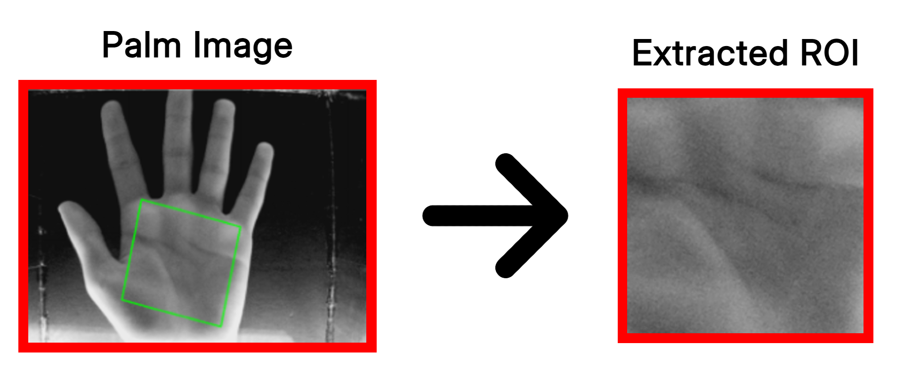

# `palm_roi` - A region-of-interest extraction tool 🖐️



A lightweight palm region-of-interest (ROI) extraction Python library, originally built for use in a palm-vein biometric imaging device. It makes use of OpenCV and hand landmarks (using tools like [MediaPipe](https://github.com/google-ai-edge/mediapipe)) to compute an ROI of a palm in an image, calculate a rotation matrix to straighten it out, and process coordinates.

> The original Raspberry Pi example with a live camera feed has been moved to the `examples/` directory. Check out [the example's README.md](examples/README.md) for details on how to set it up!

## Installation

You can install `palm_roi` easily via pip:

```bash
pip install palm_roi
```

> **Note:** Depending on your setup (e.g., using MediaPipe to get the hand landmarks), your Python version compatibility will be constrained. The `palm_roi` library currently works with Python 3.8+, but MediaPipe currently requires Python <3.13.

## Usage

Here's an example using Mediapipe hands with `palm_roi` to extract hand landmarks and perform ROI computation:

```python
import palm_roi
import cv2
import mediapipe as mp

# 1. Provide an image and get hand landmarks from MediaPipe (or another tool)
image = # - your image data - #
hands = mp.solutions.hands.Hands(static_image_mode=True, max_num_hands=1)
results = hands.process(cv2.cvtColor(image, cv2.COLOR_GRAY2RGB))

if results.multi_hand_landmarks:
    INDEX_FINGER_MCP = results.multi_hand_landmarks[0].landmark[5]
    PINKY_MCP = results.multi_hand_landmarks[0].landmark[17]
    WRIST = results.multi_hand_landmarks[0].landmark[0]

    # 2. Apply padding, rotation, and cropping to your image automatically.
    output, error = palm_roi.extract(image, INDEX_FINGER_MCP, PINKY_MCP, WRIST)

    if not error:
        cv2.imwrite(f"output.png", output) # Save your processed ROI!

    # Alternatively, get the ROI boundaries, rotation matrix, and orientation for manual application.
    R, roi_height, l1, l2, upside_down = palm_roi.get_coords(image, INDEX_FINGER_MCP, PINKY_MCP, WRIST)
```

**See `examples/main.py` for a full implementation demonstrating real-time camera processing and Mediapipe.**
